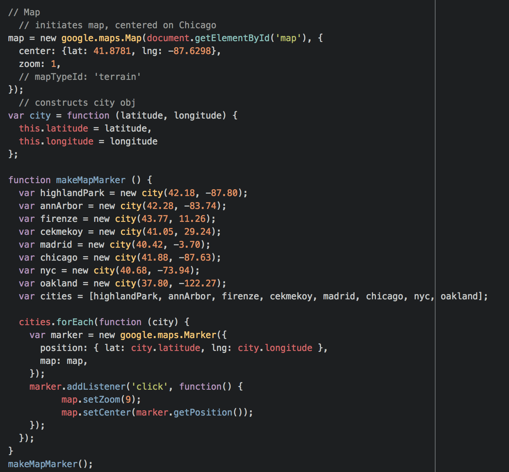
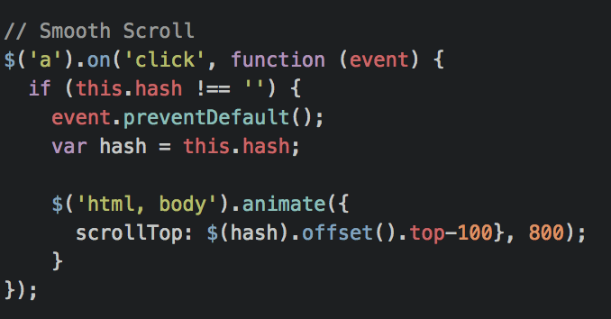

# Portfolio Site
Learn more about me and my adventures in Web Development!

#### Technologies Used
- HTML5
- CSS3
- JavaScript/jQuery
- Bootstrap

#### Process / Approach
- HTML Skeleton
- CSS3 Styling
- Finish skeleton
- Begin adding interactive features:
  - one section at a time
- Tweak for Responsiveness

#### Unsolved Problems 😤 💻 🗡 🗡 🗡 🗡
- NavBar highlighter

#### Big Wins
- Using google maps API

    

- Smooth Scroll

    

- Responsiveness
- Overall look and feel of the site
